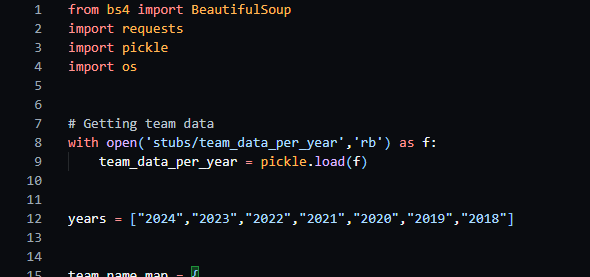
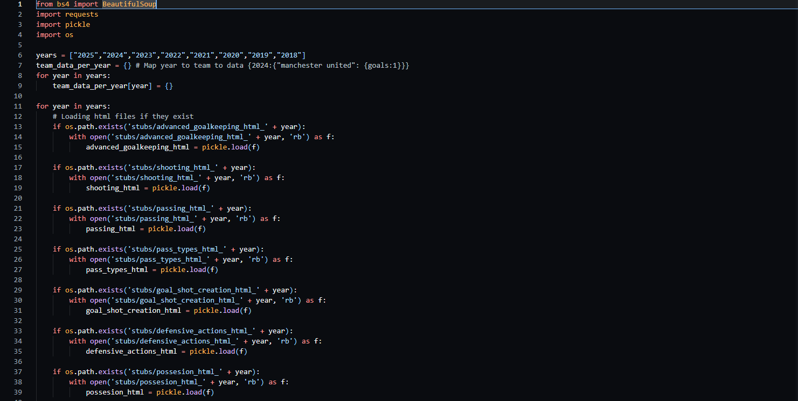
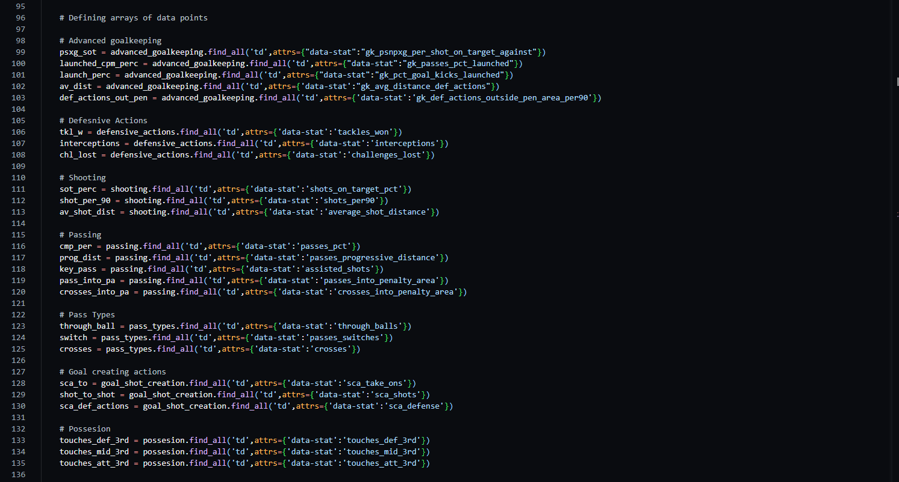
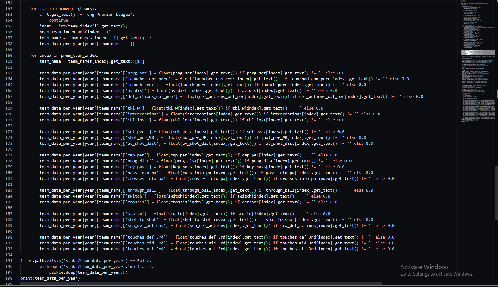
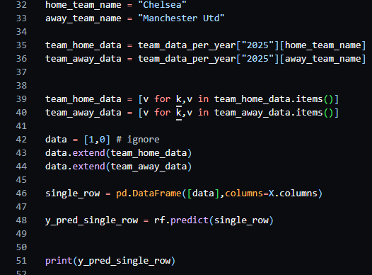
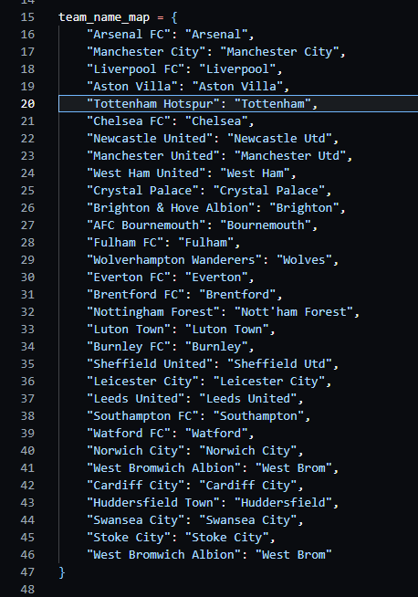

# PredictPremGames
### Built with
* [![Python][Python.py]][Python-url]
* [![BeautifulSoup][BeautifulSoup.py]][BeautifulSoup-url]
* [![scikit][scikit-learn]][scikit-learn-url]

# About the Project
This project is a tool for football analysts and enthusiats to gather data on football teams and football match results, and to see predictions made based on data points. This can be used to see what statistics affect match outcomes the most.

### Key Features:
- **Scrape football team data**: This generates an object which has each year from 2018 - 2024 mapped to team's which is mapped to the teams data.
- **Scrape match results**: It also scrapes match results and generates an object which has each game result mapped to the year it took place.
- **Predict game results**: Combining the match results and football team data it makes a prediction based on two teams data sets on what the score will be.

# Usage
#### In the prem_team_details.py file, this code is used to scrape team data and convert it into an object stored by stubs. The object is mapped like this: team_data_per_year["year"]["team"]["data_point] = ['data']. If the end of the current football year is beyond 2025 you can add more years to keep it up to date.

#### You can change what data points are used by, going to the site, grabbing the data-stat in the td tag of what data point you want to use editing the {'data-stat':'your_data_point'} with your data point and also changing the corresponding mapping below.

#### If you want to rescrape the data delete the data in the stubs folder but do not delete the folders inside of stubs.
#### To predict with two teams enter the home and away team name, refer to the prem_match_history file for name spelling, the value of the objects are the correct spelling.

## Contact
#### Afolabi Adekanle - afolabiadekanle@gmail.com - [![linkedin][linked-in]][LinkedIn-url]
<!-- MARKDOWN LINKS & IMAGES -->
[BeautifulSoup.py]:https://shields.io/badge/BeautifulSoup-4-green
[BeautifulSoup-url]:https://pypi.org/project/beautifulsoup4/
[scikit-learn]:https://img.shields.io/badge/scikit%20learn-F7931E?style=for-the-badge&logo=scikit-learn&logoColor=white
[scikit-learn-url]:https://scikit-learn.org/stable/#
[Python.py]:https://img.shields.io/badge/python-3670A0?style=for-the-badge&logo=python&logoColor=ffdd54
[Python-url]:https://www.python.org/
[linked-in]: https://img.shields.io/badge/LinkedIn-0077B5?style=for-the-badge&logo=linkedin&logoColor=white
[LinkedIn-url]: https://www.linkedin.com/in/afolabi-adekanle-68428b1b6/
